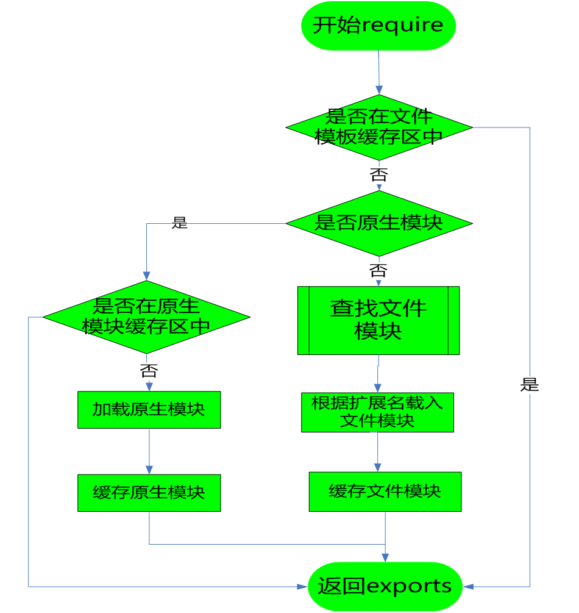

# 一、commonjs 模块机制

## 1、加载策略

require 到获取 exports 的过程：
- 在模板文件缓存区中，直接拿到 exports
- 不在模板文件缓存区中
    - 原生模块
        - 在原生模板文件缓存区中，直接拿到 exports
        - 不在原生模板文件缓存区中
            1. 加载原生模块
            2. 缓存原生模块
            3. 拿到 exports
    - 文件模块
        1. **查找文件模块**（过程见下节）
        2. 根据扩展名载入
        3. 缓存文件模块
        4. 拿到 exports

### 使用同步加载原因

- 同步加载阻塞，可能造成整体效率不如异步加载，但是依然使用了同步加载方式，为什么？
- 模块实现缓存，第一次加载后会缓存 exports 对象，再次加载直接读缓存
- 放在 require.cache 对象中，key 是绝对路径（这样才有复用的意义）

## 2、查找策略

1. 先看 require 写法，获取查找路径
    - require('./xx') 相对路径
        1. 是否从包加载
        2. 路径为当前路径
    - require('xx') 包路径
        1. 查找 module.paths
            - ['', '', '']
            - 从当前目录一直到根目录，每层下的 node_modules 目录均是数组的一项
        2. 查找 global Module 
            - Window 如果在环境变量中设置了 NODE_PATH 变量，并将变量设置为一个有效的磁盘目录，就是全局目录
            - UNIX 操作系统中会从 $HOME/.node_modules $HOME/.node_libraries 目录下寻找
2. 判断查找路径是否为绝对路径
    - 是绝对路径，则清空查找路径，不需要再找
    - 是相对路径，不做操作（保留查找路径）
3. 查看是否已缓存，根据查找路径和文件名
    - 已缓存，则获取实际文件路径，缓存结束查找
    - 未缓存
        1. 直接按文件查，成功，则获取实际文件路径，缓存结束查找
        2. 尝试添加文件扩展名查，成功，则获取实际文件路径，缓存结束查找
        3. 按文件夹查，找文件夹中的 package.json 的 main 对应的文件，成功，则获取实际文件路径，缓存结束查找
        4. package.json 的 main 对应的文件添加文件扩展名查，成功，则获取实际文件路径，缓存结束查找
        5. 找文件夹中的 index(.js/.node) ，成功，则获取实际文件路径，缓存结束查找
        6. 进入下一 module.paths（也就是 node_modules）中查，再顺序中执行上面的步骤

# 二、异步单线程

单线程的原因：js 应用于浏览器，为了避免多线程同时操作一个 DOM 引起的问题，采用单线程

- Node 的首要目标是提供一种简单的，用于创建高性能服务器的开发工具
    - 并不是一门语言，而是工具
- Web 服务器的瓶颈在于并发的用户量，node 支持高并发
    - 传统的多线程、阻塞I/O（同步）
        - 维护一个线程池，每个线程都会占用一定内存
        - 多线程并不是同一时间点执行多个任务，而是通过快速切换时间线来实现 
        - 多线程并发存在共享资源的处理问题，需要用锁来处理
    - node 单线程（主线程）、非阻塞I/O（异步）
        - 节约内存，单线程
        - 节约上下文切换时间
        - 不需要加锁，单线程
- 基于 Chrome v8 引擎，执行效率非常高
    - 编译语言执行快，解析语言执行慢
    - v8 引擎使得 js 这种解析语言执行加快

简单记，线程共享`堆`和进程的一些东西，不共享`栈`。

# 三、任务队列

## 说明

1. 所有同步任务都在主线程上执行，形成一个执行栈
2. 主线程之外，还存在一个任务队列。只要**异步任务有了运行结果（执行完才放入队列）**，就在任务队列之中放置一个事件。
3. 一旦执行**栈中的所有同步任务执行完毕，系统就会读取任务队列**，看看里面有哪些事件。那些对应的异步任务，于是结束等待状态，进入执行栈，开始执行。
4. 主线程不断重复上面的第三步。

## 执行栈概念及执行过程

- 执行上下文环境栈（私有闭包）由 this、参数、私有变量、上级作用域变量组成
- 函数调用时，各级函数的执行上下文，从外到内依次进站，栈底是全局上下文
- 函数执行时，各级函数从内到外依次执行，每执行到某层函数，对应的栈中的执行上下文就是当前上下文，执行完就出栈，继续调用下一个执行上下文，直到执行栈清空，函数执行完毕

## 宏任务、微任务

- 宏任务
    - 放到 callback queue，等执行栈同步任务执行完且微任务队列清空后，才会逐个调用其中的回调
    - 希望异步执行，执行时限不要求
    - 常见的：ajax、setTimeout、setImmediate
- 微任务
    - 放到 task queue（在执行栈栈底，比较奇怪，添加到栈底？），等执行栈同步任务执行完后开始调用
    - 希望异步执行，但是要尽快执行
    - 常见的：Promise.then、process.nextTick

# 四、事件循环 Event Loop

> 一个 node 实例就是一个进程，node 是单线程，通过事件循环来实现异步 

主线程从任务队列中读取事件，这个过程是循环不断的，所以整个的这种运行机制又称为Event Loop(事件循环)。注：图比较旧，没有显示出微任务队列。

node 中的 Event Loop

1. V8引擎解析JavaScript脚本。
2. 解析后的代码，调用Node API。
3. libuv库负责Node API的执行。
    - 它将不同的任务分配给不同的线程，形成一个Event Loop（事件循环），以异步的方式将任务的执行结果返回给V8引擎。
    - 实际上任务执行的还是阻塞 I/O 调用
    - 非阻塞 I/O 是通过「线程池 + 阻塞 I/O」进行模拟表现，看上去是异步的，但是底层还是同步实现
4. V8引擎再将结果返回给用户
